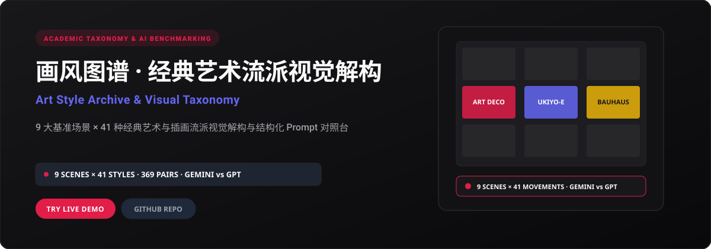

<p align="right">
  <strong>简体中文</strong> · <a href="./README.en.md">English</a>
</p>

<p align="center">
  
</p>

<p align="center">
  <a href="https://art-style-showcase.xiaosang.cc/"><strong>🌐 在线体验 (Live Demo)</strong></a> · 
  <a href="https://holynova.github.io/art-style-showcase/"><strong>🚀 备选镜像 (GitHub Pages)</strong></a> · 
  <a href="https://github.com/holynova/art-style-showcase"><strong>📦 GitHub 源码</strong></a> · 
  <a href="https://xiaosang.cc/"><strong>✨ 更多作品集</strong></a>
</p>

---

## 真实预览 (Proof of Work)

<p align="center">
  
</p>

---

## 项目简介 (What It Is)

用严谨的科研对照组思维构建的经典艺术流派图谱。建立 9 组跨类别标准基准场景（都市雨夜、荒野原野、静物陈列等），横向贯通测试 41 种经典绘画、版画与现代插画流派。提供笔触肌理、色彩语言、光影逻辑的多维度解构，支持双画风同屏对比与双模型细节实测。

---

## 核心机制与特色 (Why It Matters)

- **基准变量控制法**：保持画面主体内容与构图严格一致，只改变流派参数，精准剥离风格本身的美学特征。
- **41 大流派全景图谱**：囊括印象派、浮世绘、野兽派、Art Deco、包豪斯、波普艺术、赛博朋克等 41 种主流范式。
- **双模型并排对比台**：同屏比对 Gemini 与 ChatGPT 在相同提示词下的笔触还原度与构图偏好。
- **沉浸式巨幕灯箱**：支持 4K 级别微观笔触画质放大，配套结构化 Prompt 说明书与关键词配比。

---

## 收录清单与规格 (Inventory & Scope)

9 大基准测试场景、41 种艺术流派、369 组高精画作样本、中英双语切换、双流派自由联动对比功能。

---

## 快速开始 (Quick Start)

### 1. 在线体验
无需安装任何环境，直接在浏览器中打开：
- 🌐 **主站演示 (Primary)**：[https://art-style-showcase.xiaosang.cc/](https://art-style-showcase.xiaosang.cc/)
- 🚀 **备选镜像 (GitHub Pages)**：[https://holynova.github.io/art-style-showcase/](https://holynova.github.io/art-style-showcase/)

### 2. 本地运行与调试
克隆仓库后执行以下命令：

```bash
git clone https://github.com/holynova/art-style-showcase.git
cd art-style-showcase
open index.html # Pure static HTML5, open directly in browser
```

---

## 开源协议与作者 (License & Author)

- **作者**：[holynova (小桑)](https://xiaosang.cc/)
- **授权协议**：[MIT License](./LICENSE)
- **合辑收录**：本仓库作为精选项目收录于 [Where Craft Lives (xiaosang.cc)](https://xiaosang.cc/)。
