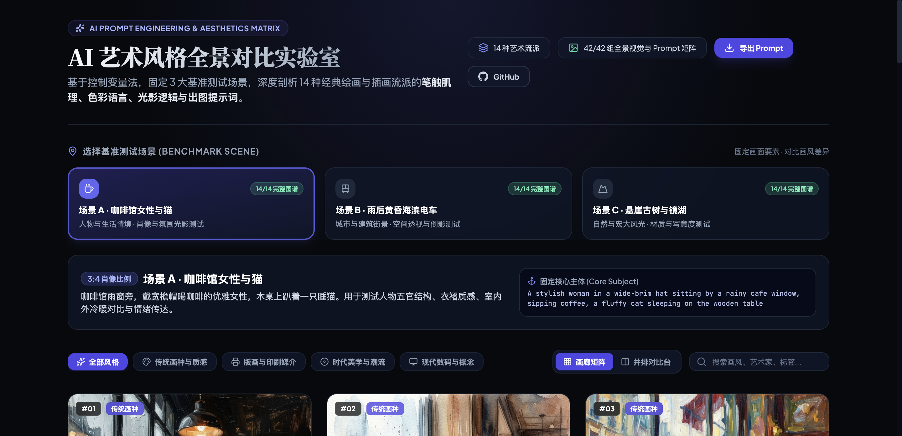

# 🎨 AI 艺术风格全景对比实验室 (Art Style Matrix & Comparator)

基于控制变量法，固定 3 大基准测试场景，深度剖析 14 种经典绘画与插画流派的**笔触肌理、色彩语言、光影逻辑与中英出图提示词**。支持 42 组全景视觉卡片浏览与双画风同屏实时深度对比。

---

## 📸 项目效果预览

---

## 🔗 在线访问与仓库链接

- 🚀 **GitHub Pages 在线演示**：[https://holynova.github.io/art-style-showcase/](https://holynova.github.io/art-style-showcase/)
- 📦 **GitHub 开源仓库**：[https://github.com/holynova/art-style-showcase](https://github.com/holynova/art-style-showcase)

---

## 📱 手机扫码即刻访问

扫描下方二维码，即可在移动端直接体验 42 组艺术风格矩阵与双画风滑动对比：

  

---

## ✨ 核心特性

1. **42 组控制变量视觉矩阵**：覆盖肖像情境（3:4）、雨后电车（16:9）与悬崖湖光（16:9）三大基准场景。
2. **14 大经典流派**：包含厚涂油画、水彩、印象派、丝网版画、浮世绘、美漫网点、City Pop、新艺术、装饰风、赛博朋克、吉卜力、极简扁平、像素风与绘本蜡笔。
3. **双画风同屏对比台**：支持并排视图与交互式无级滑动拆分，直观剖析笔触、光影与色调差异。
4. **一键复制与导出**：支持单张 Prompt 快速复制与场景全量提示词一键导出。

---

## 📄 开源协议

本项目采用 [MIT License](LICENSE) 开源。
